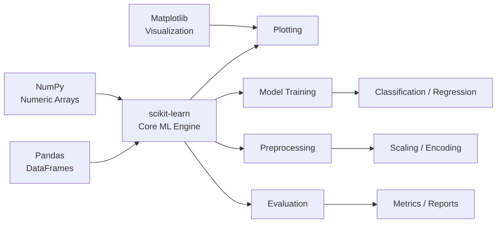

# 📘 Chapter 1 — Core Machine Learning with scikit-learn

*A complete beginner-friendly introduction to classical ML using scikit-learn.*

---

## 1. Chapter Goals

After completing this chapter, you will be able to:

* Understand the role of **scikit-learn** within the Python ecosystem
* Load datasets, preprocess features, train a model, and evaluate results
* Use essential scikit-learn tools:

  * `train_test_split`
  * `StandardScaler`
  * `LogisticRegression`
  * `classification_report`
* Build a fully functional ML workflow from start to finish
* Modify hyperparameters and try different models

This chapter is **self-contained**. Even if you learn only Chapter 1, you can already complete real ML tasks.

---

## 2. Relationship Map: Where scikit-learn Fits



### Quick interpretation

* **NumPy**: numeric operations
* **Pandas**: load & clean data
* **scikit-learn**: core ML algorithms
* **Matplotlib**: visualization support

---

## 3. Why scikit-learn?

scikit-learn is one of the most widely used classical machine learning libraries because:

* It has a **simple and consistent API**
* All models follow the same pattern:

  ```
  model.fit()
  model.predict()
  model.score()
  ```
* It includes:

  * classification models
  * regression models
  * clustering algorithms
  * preprocessing tools
  * model selection utilities
* It is stable, fast, and ideal for **small and medium-sized datasets**

This chapter introduces the essential workflow used in most ML projects.

---

## 4. Minimal Fully-Functional Example

Below is a **complete ML workflow** using the Iris dataset.

Save this as:

```
01_classification_basics.ipynb
```

---

### **Basic Classification with scikit-learn**

```python
# ============================================================
# Basic Classification with scikit-learn
# ============================================================

import numpy as np
from sklearn.datasets import load_iris
from sklearn.model_selection import train_test_split
from sklearn.preprocessing import StandardScaler
from sklearn.linear_model import LogisticRegression
from sklearn.metrics import classification_report, confusion_matrix
import matplotlib.pyplot as plt

# ------------------------------------------------------------
# 1. Load dataset
# ------------------------------------------------------------
X, y = load_iris(return_X_y=True)

print("Dataset shape:", X.shape)
print("Unique classes:", np.unique(y))

# ------------------------------------------------------------
# 2. Train-test split
# ------------------------------------------------------------
X_train, X_test, y_train, y_test = train_test_split(
    X, y, test_size=0.2, random_state=42, stratify=y
)

# ------------------------------------------------------------
# 3. Standardize features
# ------------------------------------------------------------
scaler = StandardScaler()
X_train_std = scaler.fit_transform(X_train)
X_test_std = scaler.transform(X_test)

# ------------------------------------------------------------
# 4. Train the model
# ------------------------------------------------------------
clf = LogisticRegression(max_iter=1000)
clf.fit(X_train_std, y_train)

# ------------------------------------------------------------
# 5. Predictions
# ------------------------------------------------------------
y_pred = clf.predict(X_test_std)

# ------------------------------------------------------------
# 6. Evaluation
# ------------------------------------------------------------
print("\n=== Classification Report ===")
print(classification_report(y_test, y_pred))

print("\n=== Confusion Matrix ===")
print(confusion_matrix(y_test, y_pred))

# ------------------------------------------------------------
# 7. Visualization (optional)
# ------------------------------------------------------------
plt.figure(figsize=(6,4))
plt.scatter(X_test_std[:, 0], X_test_std[:, 1], c=y_pred, cmap='viridis', edgecolors='k')
plt.title("Test Samples Colored by Predicted Class")
plt.xlabel("Standardized Feature 1")
plt.ylabel("Standardized Feature 2")
plt.show()
```

---

## 5. Workflow Explanation

### **Step 1 — Load dataset**

scikit-learn provides classic small datasets (Iris, Wine, Breast Cancer) for learning.

### **Step 2 — Train/test split**

Keeps the experiment fair and prevents information leakage.

### **Step 3 — Feature scaling**

Some models (Logistic Regression, SVM, KNN) perform better after standardization.

### **Step 4 — Model training**

`.fit()` trains the model on the training data.

### **Step 5 — Prediction**

`.predict()` generates class labels.

### **Step 6 — Evaluation**

`classification_report` gives:

* precision
* recall
* f1-score

### **Step 7 — Visualization**

Simple scatter plot showing predicted clusters.

---

## 6. Exercises (Optional)

These small tasks help the reader explore and learn by modifying the pipeline.

### 🔹 Exercise 1 — Try a different model

Replace Logistic Regression with:

```python
from sklearn.svm import SVC
clf = SVC(kernel="rbf", C=1.0)
```

Or:

```python
from sklearn.ensemble import RandomForestClassifier
```

---

### 🔹 Exercise 2 — Compare with and without scaling

Run the experiment twice:

* With StandardScaler
* Without StandardScaler

Observe accuracy differences.

---

### 🔹 Exercise 3 — Change the test size

Try:

```python
test_size=0.3
test_size=0.1
```

---

### 🔹 Exercise 4 — Plot Confusion Matrix Heatmap

(Hints: use `plt.imshow()` or seaborn)

---

### 🔹 Exercise 5 — Predict custom input

Allow users to type in flower measurements and run:

```python
clf.predict([your_input])
```

---

## 7. Next Chapter

If you want to go deeper:

### 👉 **Go to Chapter 2 — Hyperparameter Optimization using scikit-optimize**

In Chapter 2, you will learn:

* Why hyperparameters matter
* What Bayesian Optimization is
* How to use `BayesSearchCV` to automatically search for the best model settings
* How to build a high-performing ML pipeline

---

**“Start Chapter 2”**
