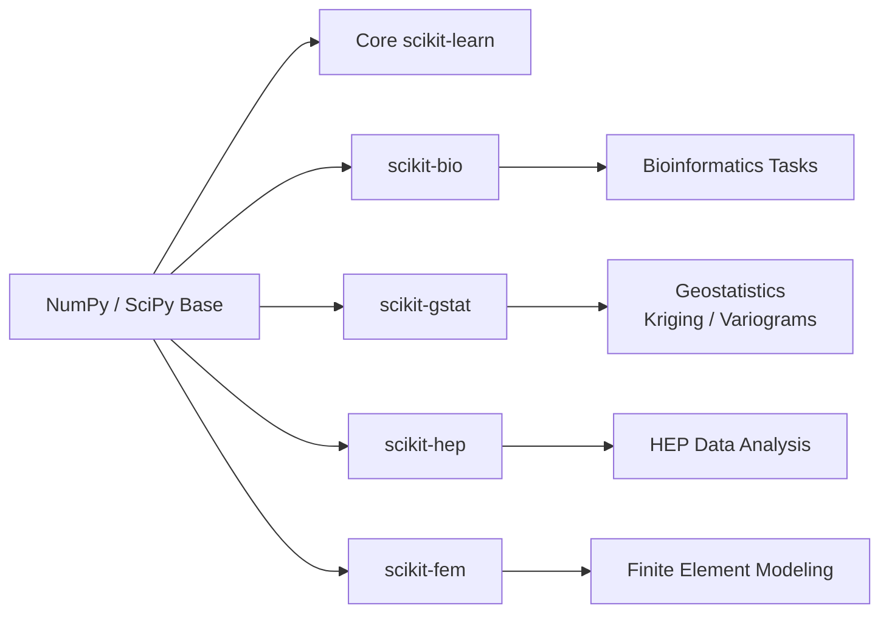

# 📘 Chapter 5 — Domain-Specific scikit Extensions

*Applying the scikit ecosystem to biology, geostatistics, physics, and finite-element modeling.*

---

## 1. Chapter Goals

After completing this chapter, you will understand:

* The purpose of major domain-specific scikit libraries
* How these specialized kits extend the scikit ecosystem
* How to run minimal working examples for each domain
* How these tools integrate with NumPy, SciPy, and scikit-learn
* How to build domain-centric pipelines (bio / geo / physics / FEM)

Even if you read only one subsection (e.g., scikit-bio), each subchapter is self-contained and complete.

---

## 2. Relationship Map: How Domain scikit Libraries Fit Together



### Interpretation

* All domain-specific scikit kits sit on top of **NumPy + SciPy**
* Some integrate directly with **scikit-learn** for ML tasks
* Each is designed for a *specific research field*

---

# 3. scikit-bio — Biological Sequence & Microbiome Analysis

`scikit-bio` is a powerful toolkit for:

* DNA/RNA/protein sequence analysis
* Alignment & FASTA parsing
* Phylogenetics
* Microbiome diversity metrics
* Statistical ecological analysis

### Installation

```
pip install scikit-bio
```

---

## 🔬 3.1 Minimal Working Example: DNA Sequence Analysis

```python
from skbio import DNA
from skbio.alignment import global_pairwise_align_nucleotide

seq1 = DNA("ACCGTGGAT")
seq2 = DNA("ACGGTGCAT")

score, alignment, _ = global_pairwise_align_nucleotide(seq1, seq2)

print("Alignment score:", score)
print(alignment)
```

### Output Example

```
Alignment score: 6
ACCGTGGAT
ACGGTGCAT
```

---

## 🔬 3.2 Example: Alpha Diversity (Microbiome)

```python
import numpy as np
from skbio.diversity import alpha_diversity

counts = np.array([
    [10, 20, 5, 0], 
    [5, 15, 30, 10]
])

indices = alpha_diversity("shannon", counts)

print(indices)
```

---

## 🔬 When to Use scikit-bio

* Microbiome analysis
* Evolutionary biology
* Metagenomics
* DNA/RNA feature extraction before ML
* Ecological diversity measurement

---

# 4. scikit-gstat — Geostatistics and Spatial Modeling

`scikit-gstat` is widely used in:

* spatial interpolation
* variogram modeling
* kriging
* soil property mapping
* geological exploration

### Installation

```
pip install scikit-gstat
```

---

## 🌍 4.1 Minimal Working Example: Variogram Estimation

```python
import numpy as np
from skgstat import Variogram

coords = np.array([[0,0], [1,1], [2,2], [3,3]])
values = np.array([1.1, 2.0, 2.8, 4.2])

V = Variogram(coords, values, model="spherical")
print("Effective Range:", V.parameters[0])
print("Variance Sill:", V.parameters[1])
```

---

## 🌍 4.2 Spatial Interpolation (Kriging) Example

```python
from skgstat import OrdinaryKriging

OK = OrdinaryKriging(V)
pred = OK.transform([[1.5, 1.5]])

print("Kriging prediction:", pred)
```

---

## 🌍 When to Use scikit-gstat

Perfect for soil / earth / environmental science tasks:

* Soil organic carbon mapping
* Spatial interpolation of moisture or reflectance
* Environmental monitoring networks
* Geospatial ML feature extraction

---

# 5. scikit-hep — High-Energy Physics (HEP) Toolkit

`scikit-hep` is a collection of packages for:

* analyzing particle collision data
* histogramming
* structured HEP datasets (ROOT files)
* Lorentz vectors & 4-momentum calculations
* particle tracking & identification

### Installation

```
pip install scikit-hep
pip install uproot
```

---

## ⚛️ 5.1 Minimal Working Example: Reading ROOT Data

```python
import uproot

file = uproot.open("data.root")
tree = file["Events"]

momentum = tree["particle_momentum"].array()

print(momentum[:5])
```

---

## ⚛️ 5.2 Lorentz Vector Example

```python
import vector
vec = vector.obj(px=1, py=2, pz=3, E=4)

print("Mass:", vec.mass)
print("Pt:", vec.pt)
print("Rapidity:", vec.rapidity)
```

---

## ⚛️ When to Use scikit-hep

* Particle physics
* Large-scale experimental datasets
* Detector simulations
* ML pipelines for event classification

---

# 6. scikit-fem — Finite Element Modeling

`scikit-fem` is a lightweight, Pythonic FEM solver.

It supports:

* triangular / quadrilateral meshes
* assembling stiffness matrices
* solving Poisson / heat / elasticity equations
* exporting results to visualization tools

### Installation

```
pip install scikit-fem
```

---

## 🧩 6.1 Minimal Working Example: Solve Poisson's Equation

```python
import skfem as fem
import numpy as np

mesh = fem.MeshTri().refined()

@fem.BilinearForm
def laplace(u, v, w):
    return u.grad @ v.grad

@fem.LinearForm
def rhs(v, w):
    return 1.0 * v

basis = fem.Basis(mesh, fem.ElementTriP1())
A = fem.asm(laplace, basis)
b = fem.asm(rhs, basis)

x = fem.solve(A, b)

print("Solution vector shape:", x.shape)
```

---

## 🧩 When to Use scikit-fem

* Simulating physical processes
* Heat transfer
* Elastic deformation
* Electromagnetic or mechanical modeling
* Teaching FEM concepts quickly

---

# 7. Summary Table: When to Use Each Domain Library

| Library          | Domain                | Major Tasks                    | ML Integration                  |
| ---------------- | --------------------- | ------------------------------ | ------------------------------- |
| **scikit-bio**   | Biology & Ecology     | DNA/RNA, Microbiome, Diversity | Yes: extract numerical features |
| **scikit-gstat** | Geostatistics         | Variograms, Kriging            | Yes: spatial ML                 |
| **scikit-hep**   | High-Energy Physics   | ROOT data, histograms, vectors | Yes: feature extraction         |
| **scikit-fem**   | Physics / Engineering | FEM simulations                | Yes: simulation-to-ML workflows |

---

# 8. Exercises (Optional)

### **Exercise 1 — scikit-bio**

Load a FASTA file and compute GC content and Shannon entropy.

### **Exercise 2 — scikit-gstat**

Create a 2D grid and run kriging interpolation with a spherical variogram.

### **Exercise 3 — scikit-hep**

Convert 4-momentum vectors to invariant mass and classify events using scikit-learn.

### **Exercise 4 — scikit-fem**

Simulate heat diffusion on a mesh and visualize the result.

---

# 9. Next Chapter

Continue to:

### 👉 **Chapter 6 — Patterns & Recipes: Common scikit Workflows Across Research Fields**

This chapter will show:

* The most common cross-library patterns
* Recipes for imaging, bio-data, geospatial ML, and signal processing
* How to create reusable ML pipelines
* How to combine scikit libraries effectively for real-world research

---
