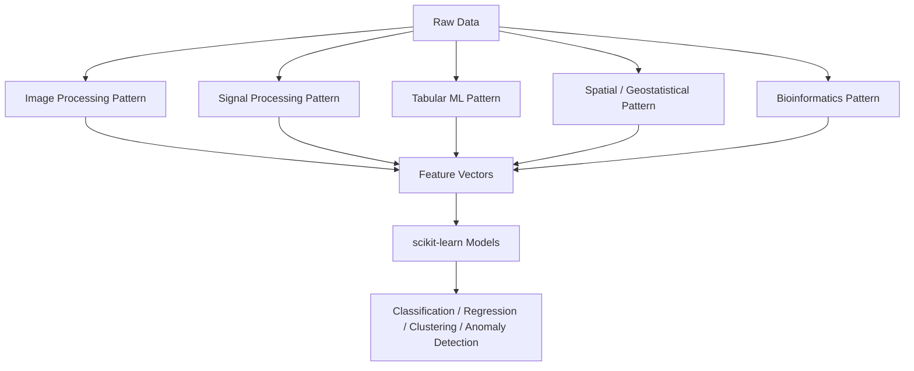
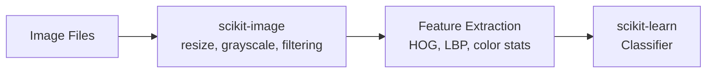
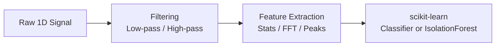
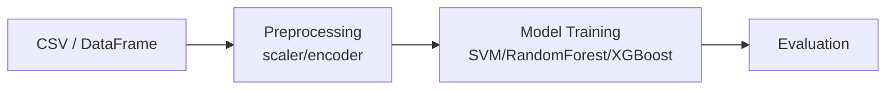
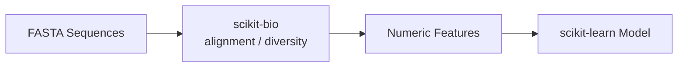

# 📘 Chapter 6 — Patterns & Recipes: Common scikit Workflows Across Research Fields

*A unified view of how scikit-learn, scikit-image, scikit-signal, and domain-specific kits combine in real projects.*

---

## 1. Chapter Goals

In this chapter you will learn:

* Reusable, high-value **project patterns** for real-world tasks
* How to combine scikit libraries effectively
* How to design modular pipelines
* How to transition from basic scikit workflows to multi-stage research pipelines
* How different fields (CV, bio, geo, energy, physics) share common processing structures

Each pattern is **self-contained**:
Even if you read only one pattern, you can build a full project with it.

---

## 2. Relationship Map: Patterns Across Domains



### Interpretation

All domains eventually produce **numerical features** that flow into **scikit-learn**.
This chapter shows how to get from raw data → features → ML.

---

# 3. PATTERN 1 — Image → Features → ML

**(scikit-image + scikit-learn)**

A classic pipeline used in:

* lightweight computer vision
* image quality testing
* microscopy analysis
* classical face/texture classification
* preprocessing for deep models

---

## 📌 When to Use

* Data too small for deep learning
* Constraints on GPU or training budget
* Goals require interpretability
* Need simple, fast traditional CV

---

## 🧩 Pattern Structure



---

## 🧪 Minimal Recipe

```python
from skimage import io, color, transform, feature
from sklearn.svm import LinearSVC

img = io.imread("sample.jpg")
img = color.rgb2gray(transform.resize(img, (128, 128)))

hog = feature.hog(img, pixels_per_cell=(8, 8))

clf = LinearSVC().fit([hog], [0])
```

---

## 🚀 Extensions

* Edge features (Sobel, Canny)
* Texture features (LBP)
* Multiscale HOG
* Use PCA before SVM
* Combine with scikit-optimize for parameter tuning

---

# 4. PATTERN 2 — Signal/Time-Series → Features → ML

**(scipy.signal / scikit-signal + scikit-learn)**

Used widely in:

* energy analytics (HVAC, chilled water, sensors)
* vibration monitoring
* medical signals (ECG/EEG)
* industrial IoT
* anomaly detection

---

## 📌 When to Use

* Raw signals need preprocessing
* Temporal dynamics matter
* Looking for anomalies or cycle detection

---

## 🧩 Pattern Structure



---

## 🧪 Minimal Recipe

```python
from scipy.signal import butter, filtfilt
from sklearn.ensemble import IsolationForest
import numpy as np

b, a = butter(4, 0.1)
filtered = filtfilt(b, a, raw_signal)

features = [np.mean(filtered), np.std(filtered), np.ptp(filtered)]
clf = IsolationForest().fit([features])
```

---

## 🚀 Extensions

* Wavelet features
* Rolling window statistics
* Spectral entropy
* Event detection with peaks
* Dynamic Time Warping (DTW) + clustering

---

# 5. PATTERN 3 — Tabular ML (The Universal Pattern)

**(pandas + scikit-learn)**

This is the **most common ML pattern in the world**.

Used in:

* finance
* biomedical datasets
* marketing
* risk scoring
* education analytics
* most Kaggle competitions

---

## 🧩 Pattern Structure



---

## 🧪 Minimal Recipe

```python
from sklearn.preprocessing import StandardScaler
from sklearn.ensemble import RandomForestClassifier

X_scaled = StandardScaler().fit_transform(X)
clf = RandomForestClassifier().fit(X_scaled, y)
```

---

## 🚀 Extensions

* One-hot encoding
* Feature selection
* Pipeline + ColumnTransformer
* Bayesian optimization for hyperparameters
* Cross-validation + model stacking

---

# 6. PATTERN 4 — Geospatial ML

**(scikit-gstat + scikit-learn)**

Used in:

* environmental science
* soil spectroscopy
* crop prediction
* hydrology
* climate monitoring

---

## 🧩 Pattern Structure

```mermaid
flowchart LR
    A[Latitude/Longitude + Values] --> B[Variogram Modeling]
    B --> C[Kriging Interpolation<br>(predict grid)]
    C --> D[scikit-learn<br>Regression / Clustering]
```

---

## 🧪 Minimal Recipe

```python
from skgstat import Variogram, OrdinaryKriging

V = Variogram(coords, values)
OK = OrdinaryKriging(V)
prediction = OK.transform([[x, y]])
```

---

## 🚀 Extensions

* Spatial cross-validation
* Feature engineering using distances
* Spatial anomaly detection
* Multi-source interpolation (elevation + soil + reflectance)

---

# 7. PATTERN 5 — Bioinformatics ML

**(scikit-bio + scikit-learn)**

Used when:

* working with DNA/RNA
* microbiome profiling
* ecological diversity
* protein sequence classification

---

## 🧩 Pattern Structure



---

## 🧪 Minimal Recipe

```python
from skbio import DNA
from sklearn.linear_model import LogisticRegression

seq = DNA("ACCGTT")
gc = (seq.sequence.count("G") + seq.sequence.count("C")) / len(seq)

clf = LogisticRegression().fit([[gc]], [1])
```

---

## 🚀 Extensions

* K-mer vectorization (k=3,4,6)
* Sequence embeddings
* Phylogenetic distance features
* Diversity-based classification

---

# 8. Cross-Domain Pattern: The “Universal scikit Pipeline”

This is the **most important takeaway of Chapter 6**.

Every domain pipeline can be generalized as:

> **Preprocess → Feature Extract → Learn → Validate → Optimize**

Represented in code:

```python
from sklearn.pipeline import Pipeline
from sklearn.preprocessing import StandardScaler
from sklearn.svm import SVC

pipeline = Pipeline([
    ("scale", StandardScaler()),
    ("clf", SVC())
])
pipeline.fit(X_train, y_train)
```

This pipeline works for:

* spectral features
* image features
* time-series features
* DNA/RNA embeddings
* geospatial numeric features

---

# 9. Patterns for Larger Research Projects

Below are **ready-to-use recipes** for multi-stage research pipelines.

### ✔ Imaging Research Workflow

* scikit-image → HOG/LBP → PCA → SVM
* With skopt for tuning

### ✔ Soil Spectroscopy Workflow

* Reflectance preprocessing → feature extraction (band ratios or CNN embedding)
* scikit-gstat for spatial interpolation
* scikit-learn for regression
* conformal prediction for uncertainty

### ✔ Energy Analytics

* signal filtering → rolling window features
* clustering (KMeans/DBSCAN)
* anomaly detection (IsolationForest)

### ✔ Bioinformatics Pipeline

* FASTA parsing → GC %, entropy, k-mers
* scikit-learn classification
* cross-validation

---

# 10. Exercises (Optional)

### **Exercise 1 — Combine 2 patterns**

Example:
Signal processing + image processing for video frames.

### **Exercise 2 — Create your own pipeline using Pipeline()**

Add:

* preprocessing
* feature extraction
* model

### **Exercise 3 — Compare 3 models on the same features**

### **Exercise 4 — Add Bayesian Optimization**

Use BayesSearchCV.

### **Exercise 5 — Build a full mini-project**

Pick one domain and reproduce a pattern with your own dataset.

---

# 11. Next Chapter (Optional)

If you want a “Chapter 7”, possible topics include:

### **📘 Chapter 7 — scikit-learn Advanced Topics**

* Pipelines
* ColumnTransformer
* Custom Transformers
* Model Explainability (SHAP / permutation importance)
* Exporting production-ready models

or

### **📘 Chapter 7 — Integrating scikit Pipelines with Deep Learning**

* Use scikit-image preprocessing with PyTorch models
* Hybrid classical + deep learning pipelines
* Feature stacking (HOG + CNN embeddings)

---
